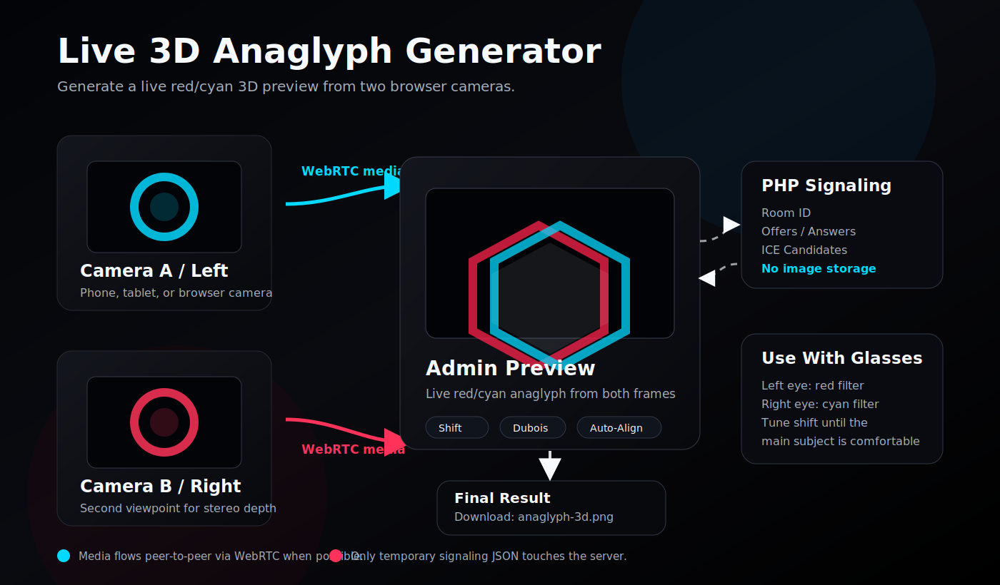

# Live 3D Anaglyph Generator

Generate a live red/cyan 3D preview from two browser cameras.

The app is built for standard PHP hosting over HTTPS. It does not store images on the server. Two phones, tablets, or browser-capable cameras stream their camera feeds directly to the admin browser via WebRTC. The live anaglyph preview is generated locally in Canvas. PHP is only used for signaling and writes small JSON files with connection metadata.



## Project Structure

Deploy these files and folders:

```text
index.php
admin.php
camera.php
api.php
assets/
data/
```

`data/` must be writable by PHP. It only contains short-lived signaling data:

- camera heartbeats
- WebRTC offers
- WebRTC answers
- ICE candidates

No JPG, PNG, preview, capture, or ZIP files are written to the server.

Local IDE and deployment settings are intentionally ignored through `.gitignore`. Do not publish `.idea/`, `.vscode/`, `.env*`, private keys, or runtime JSON files from `data/`.

## Installation

Copy the project into the HTTPS web root of your domain, for example:

```text
~/public/
```

Make sure the signaling folder is writable:

```bash
chmod 775 data
```

Open the admin page through the directory URL or through `index.php`:

```text
https://your-domain.example/
https://your-domain.example/index.php
```

`admin.php` is kept as a compatibility entry point, but `index.php` is the recommended public entry.

The admin page generates camera links with a room ID, for example:

```text
camera.php?side=a&room=...
camera.php?side=b&room=...
```

Always open the camera pages through the generated links from the admin screen.
New admin page loads without a valid `room` parameter create a fresh room ID automatically. Generated room IDs use a timestamp prefix plus 32 random hex characters.

## What Is Anaglyph 3D?

An anaglyph image combines two slightly different viewpoints into one red/cyan image. The left camera contributes the red channel, while the right camera contributes the green and blue channels. When viewed through red/cyan 3D glasses, each eye sees a different image and the brain reconstructs depth.

For a comfortable result, the two source cameras should be level, parallel, and only slightly separated. Use the live preview to adjust horizontal shift until the main subject is easy to fuse through the glasses. Keep vertical shift close to zero because vertical mismatch quickly becomes uncomfortable.

## Usage

1. Open the admin page on your laptop, tablet, or desktop.
2. Open the generated `side=a` link on camera device A.
3. Open the generated `side=b` link on camera device B.
4. Tap `Start Camera` on both camera devices.
5. Wait until both WebRTC streams are live in the admin view.
6. Adjust the anaglyph preview settings: horizontal shift, vertical shift, intensity, brightness, contrast, saturation, preview frame rate, swap images, crop edges, and auto-align.
7. Click `Take Photo`.

The admin browser downloads the current frames locally:

```text
capture-left-YYYYMMDD-HHMMSS.jpg
capture-right-YYYYMMDD-HHMMSS.jpg
anaglyph-3d-YYYYMMDD-HHMMSS.png
```

If PNG is selected for the source frames, the left and right files use `.png`.

## No Server-Side Image Storage

This version intentionally has no server endpoints for:

- image uploads
- preview images
- stored captures
- ZIP downloads

The API only accepts:

- camera heartbeat JSON
- WebRTC offer/answer JSON
- ICE candidate JSON

`api.php` also rejects JSON payloads containing `data:image/` to prevent accidental image transfer to the server.

The generated camera links include a room ID. This prevents a camera device from connecting to a random unrelated admin page on the same public domain.

## Public Deployment Hardening

The API includes basic protection for public deployments:

- request body limit: 256 KB
- SDP limit: 200 KB
- ICE candidate limit: 8 KB
- per-IP rate limit: 900 API requests per 60 seconds
- stale signaling JSON cleanup after 1 hour
- runtime JSON file cap in `data/`: 1000 files

These limits are intentionally generous enough for one admin view plus two camera devices behind the same network address. For high-traffic public demos, put the app behind normal web-server rate limiting as well.

For Apache-compatible hosting, `data/.htaccess` denies direct access to runtime files. For nginx or another server that does not read `.htaccess`, add an equivalent rule that blocks public access to `/data/`.

## Live Anaglyph Preview

The admin page creates the anaglyph preview directly from the two WebRTC video elements using Canvas.

For performance, the live preview is rendered at a maximum width of 1280 px. The `Anaglyph PNG` button and `Take Photo` workflow use the current video frame in the available stream resolution.

Available controls:

- Anaglyph mode: optimized Dubois, half-color, classic channel mix, grayscale
- horizontal shift
- vertical shift
- effect intensity
- brightness
- contrast
- saturation
- preview frame rate from 1 to 10 fps
- swap left/right images
- crop edges
- auto-align
- reset

## Best Practice Workflow

Use this workflow for reliable anaglyph captures:

1. Mount both camera devices as rigidly as possible.
2. Keep both lenses at the same height.
3. Keep the phones parallel. Avoid toe-in unless you know exactly why you need it.
4. Start with a horizontal camera distance of about 6-7 cm for normal human-scale scenes.
5. Reduce the distance for close subjects.
6. Increase the distance only for distant landscapes or large objects.
7. Avoid fast motion. Browser capture is close, but not perfectly synchronized.
8. Use good light. Low light increases noise and makes the stereo image harder to fuse.
9. Lock exposure and focus manually on both devices if possible.
10. Check the live anaglyph preview before taking the final shot.
11. Use Auto-Align first, then fine-tune horizontal shift manually.
12. Keep vertical shift near zero. Vertical mismatch is uncomfortable in red/cyan glasses.
13. Download the anaglyph PNG and inspect it with the target glasses before moving on.

Suggested camera spacing:

```text
Close-up / tabletop:        1-3 cm
Portrait / object nearby:   3-5 cm
Normal scenes:              6-7 cm
Architecture / distance:    8-15 cm
Large landscapes:           15 cm or more, carefully
```

If the 3D effect feels painful or split apart, reduce the camera distance or reduce the horizontal shift in the admin preview.

## HTTPS Requirement

Mobile Safari allows camera access only on HTTPS or localhost. For iOS camera testing on a real domain, HTTPS is required.

Safari also requires user interaction before camera permission can be requested. Each camera device must tap `Start Camera`.

## WebRTC Notes

WebRTC needs signaling and a network path between the admin browser and both camera devices. This app uses PHP only for signaling and a public STUN server for connection discovery. Media is not routed through PHP.

Known limits:

- Without a TURN server, WebRTC can fail in restrictive networks.
- It usually works well when all devices are in the same Wi-Fi network.
- It can also work across normal Wi-Fi/mobile networks, depending on NAT/firewall behavior.
- If a stream does not appear, click `Reconnect` in the admin view and restart the camera on the affected device.
- Perfect photographic synchronization is not guaranteed in a browser-only setup. The admin browser captures both currently received WebRTC frames in the same click workflow.

## Server Check

Run these checks on the server:

```bash
php -l index.php
php -l admin.php
php -l camera.php
php -l api.php
```

No Node.js process is required in production.

## Privacy Checklist

Before deploying publicly:

- Confirm that `.idea/`, `.vscode/`, `.env*`, private keys, and deployment settings are not committed.
- Confirm that `captures/` and `previews/` do not exist.
- Confirm that `data/` contains only JSON signaling files.
- Keep `data/.htaccess` in place so the signaling files are not web-readable.
- Do not add logging of request bodies to the web server for this path.
- Use the generated room links and avoid sharing them publicly.
